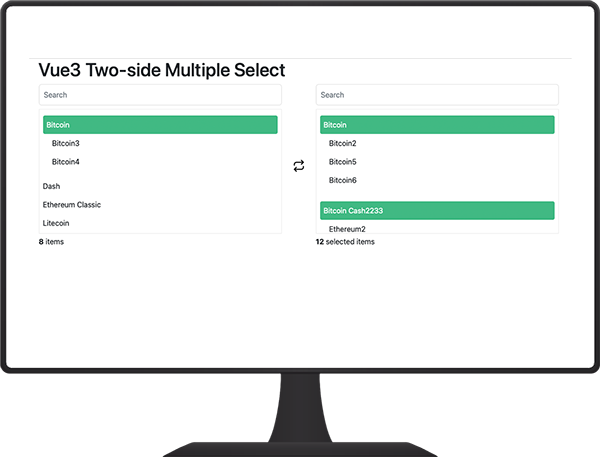

# vue3-two-side-multiple-select

A MultiSelect with two lists for Vue.js v.3, searchable, sorting and action buttons.

enable group list move and remove


## Install npm

```bash
npm install vue3-two-side-multiple-select --save
```

## Import and use

Import for global usage
```javascript
import { createApp } from 'Vue'
import MultipleSelect from 'vue3-two-side-multiple-select'
import App from "./App"

const app = createApp(App)
app.component('multiple-select', MultipleSelect)
app.mount('#app')
...
```
Or on a single component
```javascript
import MultipleSelect from 'vue3-two-side-multiple-select'
...
},
components: { MultipleSelect }
...
```

## Props

| Name                  | Type             | Default         | Description                                                              |
|-----------------------|------------------|-----------------|--------------------------------------------------------------------------|
| items                  | Array           | | Array of items to select                                               |
| selectedItems         | Array |              | Array of selected items  |
| valueField         | String | value             | Value field |
| textField          | String | text             | Text field |
| childField         | String | children            | Text field |
| showField          | String | disabled            | Text field |
| searchable         | Boolean | false             | If enabled, it will display search fields for lists. |
| searchablePlaceholder | String | Search | Placeholder of inputs search
| sorteable | Boolean | false | Sort array by property name
| orderBy | String | id | Property name to sort
| textItems | String | items | Counter text that is below the left list
| textSelectedItems | Object | {one: 'selected item', greaterThanOne: 'selected items'} | Counter text that is below the right list
| limitSelectedItems | Number | 999 | Limit items that the user can select
| disabled           | Boolean | false             | Disable select |
| frontEnd           | String  | bootsrap          | bootsrap, bulma|

## Events

| Name                   | Description                                                              |
|------------------------|--------------------------------------------------------------------------|
| itemAdded              | When an item has been added to the list  |
| itemRemoved            | When an item has been removed from the list  |
| selectedListModified   | When the selected list has been modified  |


## How to use


After you have installed the package and imported it, call the component's html and pass its properties.

```html
<multiple-select
  :items="arrayOfItems"
  :selectedItems="arrayOfSelectedtems"
  :searchable="true"
  :disabled="false"
  :sorteable="true"
  :orderBy="'name'"
  :showTextSelectedItem="true"
  :limitSelectedItems="999"
  text-field="name"
  value-field="id"
  ></multiple-select>
```
```javascript
arrayOfItems: [
    {
        id: 1,
        name: 'Bitcoin',
        children: [
            {
                id: 22,
                name: 'Bitcoin2'
            },
            {
                id: 23,
                name: 'Bitcoin3',
                disabled: true
            },
            {
                id: 24,
                name: 'Bitcoin4'
            },
            {
                id: 25,
                name: 'Bitcoin5'
            },
            {
                id: 26,
                name: 'Bitcoin6'
            }
        ]
    },
    {
        id: 2,
        name: 'Ethereum',
        disabled: true
    },
    {
        id: 3,
        name: 'Ripple'
    }
```
Rtl is available when the body has the class is-rtl
```html
<body class="is-rtl"></body>
```
## Contributing

To contribute to this project you can clone the repository and run the npm run dev command to test.

```javascript
npm install

npm run dev

npm publish
```